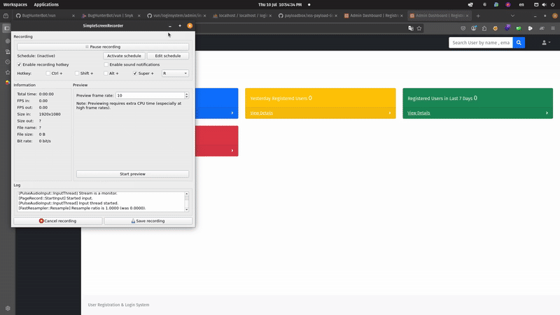

# 🛡️ Reflected XSS Vulnerability in User Registration & Login and User Management System With Admin Panel <= v3.3

## 👨‍💻 Bug Author
**4m3rr0r**

---

## 📦 Product Information

- **Vendor:** [PHPGurukul](https://phpgurukul.com)
- **Product:** User Registration & Login and User Management System With Admin Panel
- **Version:** <= v3.3
- **Size:** 212 KB
- **License:** Free

---

## 🛠 Vulnerability Details

### 🧨 Vulnerability Type
- **Reflected Cross-Site Scripting (XSS)**  
- **CWE-79:** Improper Neutralization of Input During Web Page Generation

### 🧬 Root Cause
Unfiltered user input from the search field in the admin dashboard is directly rendered into the HTML output. This allows attackers to inject and execute arbitrary JavaScript in the context of the admin user's browser.

### ⚠️ Impact
- Arbitrary JavaScript execution
- Admin session hijacking
- Credential theft
- Phishing via redirection
- Full compromise of admin browser environment

---

## 📋 Description

The vulnerable file is:


loginsystem/admin/search-result.php


When a malicious script is entered manually into the **search field** in the admin dashboard, the application reflects that input back into the page without proper sanitization or encoding. This results in **reflected XSS**, where the payload is executed in the browser of the logged-in admin.

This input is not passed via URL or GET request but entered manually via the UI — possibly handled via POST or JavaScript on the frontend.

---

## 🔬 Proof of Concept (PoC)

### 🔧 Steps to Reproduce:

1. Login to the admin panel.
2. In the top-right search input, type the following payload:

    ```html
    <script>alert(document.domain)</script>
    ````

3. Press Enter or click the search icon.
4. A JavaScript `alert()` will trigger, confirming the XSS.





---

## 🛡 Suggested Remediation

* Use `htmlspecialchars()` to encode user input before rendering
* Implement proper input validation and sanitization
* Enforce Content Security Policy (CSP) headers
* Consider switching to a secure templating engine

---

## 🔐 Security Recommendations

* Always validate and escape user input on both client and server side
* Avoid direct output of raw input in dynamic pages
* Use automated tools like [Snyk](https://snyk.io/) or [SonarQube](https://www.sonarqube.org/) for regular scans
* Implement strict CSP and use Subresource Integrity (SRI) for scripts

---

## 📚 References

* [CWE-79: Improper Neutralization of Input During Web Page Generation (XSS)](https://cwe.mitre.org/data/definitions/79.html)
* [OWASP Cross Site Scripting (XSS)](https://owasp.org/www-community/attacks/xss/)

---


