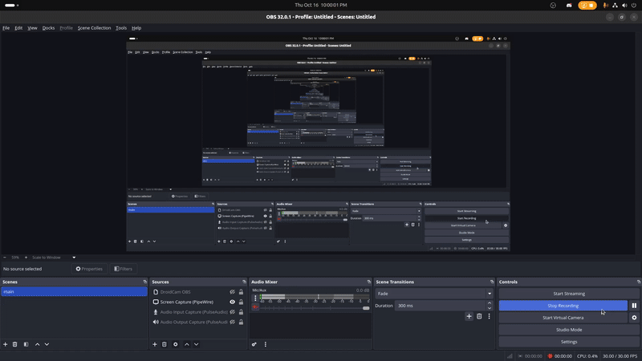

# [Reflected Cross-Site Scripting (XSS)] in [ bdtask Isshue - Multi Store eCommerce Shopping Cart Solution With POS v-4,0 ]

---

### 👨‍💻 **BUG Author:**

### 4m3rr0r

---

### 📦 **Product Information:**

* **Vendor Homepage:** [https://www.bdtask.com/](https://www.bdtask.com/)
* **Software Link:** [https://codecanyon.net/item/isshue-multi-store-ecommerce-shopping-cart-solution/21576648](https://codecanyon.net/item/isshue-multi-store-ecommerce-shopping-cart-solution/21576648)
* **Demo URL:** [https://isshue.bdtask-demo.com/isshue_v5_demo/admin](https://isshue.bdtask-demo.com/isshue_v5_demo/admin)
* **Affected Version:** V-4.0
* **BUG Author:** 4m3rr0r

---

### 🛠 **Vulnerability Details**

* **Type:** Reflected Cross-Site Scripting (XSS)
* **Affected URL:** `/isshue_v5_demo/dashboard/Ccustomer/manage_customer`
* **Vulnerable Parameter:** The search parameter in the "Manage Customer" field.
* **Vulnerable Component:** The customer search functionality.

---

### 🧨 **Vulnerability Type**

* **Cross-Site Scripting (XSS)**
* **CWE ID:** CWE-79: Improper Neutralization of Input During Web Page Generation ('Cross-site Scripting')
* **Severity Level:** MEDIUM
* **CVSS Score:** 6.1 (Medium)

---

### 🧬 **Root Cause**

The application takes user input from the panel-title in the "Manage Customer" page and reflects it back in the HTML response without proper output encoding or sanitization. This allows an attacker to inject arbitrary JavaScript code, which will be executed in the context of the victim's browser session.

---

### ⚠️ **Impact**

* **Session Hijacking:** An attacker can steal a user's session cookie (`ci_session`) to impersonate them and take over their account.
* **Credential Theft:** The script can be used to generate a fake login form on the page to trick the user into entering their credentials.
* **Phishing:** The victim can be redirected to a malicious website.
* **Keylogging:** The attacker can capture all keystrokes made by the victim on the compromised page.

---

### 🔬 **Proof of Concept (PoC)**

A video demonstrating this vulnerability has been recorded and can be viewed here:

 


**Text-Based Steps:**

1.  Log in to the application.
2.  Navigate to the "Manage Customer" page:
    `https://isshue.bdtask-demo.com/isshue_v5_demo/dashboard/Ccustomer/manage_customer`
3.  In the panel-title, inject a standard XSS payload, such as:
    ```html
    <script>alert('XSS')</script>
    ```
4.  Submit the search.
5.  The application will execute the JavaScript, and an alert box with the text "XSS" will appear, confirming the vulnerability.


---

### 🛡 **Suggested Remediation**

* **Context-Aware Output Encoding:** The most important fix is to implement strong, context-aware output encoding on all user-supplied data before it is rendered in the HTML. For example, characters like `<` and `>` should be converted to their HTML entity equivalents (`&lt;` and `&gt;`).
* **Input Validation:** As a secondary defense, validate all user input to ensure it matches the expected format (e.g., a customer name should not contain script tags).
* **Content Security Policy (CSP):** Implement a strict CSP to prevent the browser from executing inline scripts and to restrict the domains from which scripts can be loaded.

---

### 📚 **References**

* [OWASP Cross-Site Scripting (XSS)](https://owasp.org/www-community/attacks/xss/)
* [CWE-79: Improper Neutralization of Input During Web Page Generation ('Cross-site Scripting')](https://cwe.mitre.org/data/definitions/79.html)

---
