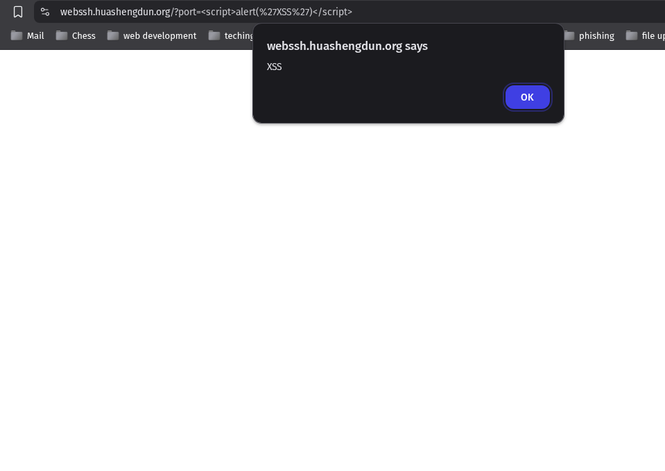

# \[xss] in \[WebSSH] <= \[v1.6.2]

---

### 👨‍💻 BUG Author:

**4m3rr0r**

---

### 📦 Product Information:

* **Vendor Homepage:** [https://huashengdun.org](https://huashengdun.org)
* **Software URL:** [https://github.com/huashengdun/webssh](https://github.com/huashengdun/webssh)
* **Affected Version:** <= **v1.6.2**
* **BUG Author:** 4m3rr0r
* **Discovery Date:** April 9, 2025

---

### 🛠 Vulnerability Details

* **Type:** Reflected Cross-Site Scripting (XSS)
* **Affected Parameter:** `port` (GET)
* **Affected URL:**
  `https://webssh.huashengdun.org/?port=<script>alert(1)</script>`

---

### 🧨 Vulnerability Type

* **Category:** Reflected XSS Vulnerability
* **CWE ID:** [CWE-79: Improper Neutralization of Input During Web Page Generation ('Cross-site Scripting')](https://cwe.mitre.org/data/definitions/79.html)
* **Severity Level:** HIGH
* **CVSS Score:** 7.1 (Base Score)

---

### 🧬 Root Cause

The application reflects unsanitized user input from the `port` query parameter directly into the HTML response without input validation or output encoding, enabling the execution of arbitrary JavaScript code in the user's browser.

---

### 🛠 Vulnerable Endpoint Example

```url
https://webssh.huashengdun.org/?port=<script>alert(1)</script>
```

---

### ⚠️ Impact

* Execution of arbitrary JavaScript in the victim’s browser
* Session hijacking and credential theft
* Phishing via trusted domain
* Cross-site request forgery (CSRF) via JS
* Browser-based malware injection

---

### 📋 Description

This reflected XSS vulnerability exists in WebSSH <= v1.6.2 via the `port` parameter. An attacker can construct a malicious URL to inject JavaScript into the server's response, causing it to execute in a victim's browser. This issue is separate from any previous XSS findings in the `hostname` parameter.

---

### 🔗 Public Disclosure

* GitHub Issue: [https://github.com/huashengdun/webssh/issues/410](https://github.com/huashengdun/webssh/issues/410)
* Date Disclosed: April 9, 2025

---

### 🔬 Proof of Concept (PoC)

#### ✅ Confirmed Payload:

```url
https://webssh.huashengdun.org/?port=<script>alert('XSS')</script>
```

#### 🖼 Screenshot:

 

---

### 🛡 Suggested Remediation

* Apply strict input validation (e.g., ensure `port` is numeric-only)
* Escape or encode dynamic content before rendering to HTML
* Use a templating engine that auto-escapes user inputs
* Apply a strong Content Security Policy (CSP)

---

### 🔐 Security Recommendations

* Sanitize and validate all user inputs
* Enable HTTP-only and Secure cookie flags
* Perform regular code audits and XSS testing
* Use a Web Application Firewall (WAF)
* Educate developers on secure coding practices

---

### 📚 References

* [OWASP XSS Prevention Cheat Sheet](https://owasp.org/www-project-cheat-sheets/cheatsheets/Cross_Site_Scripting_Prevention_Cheat_Sheet.html)
* [CWE-79](https://cwe.mitre.org/data/definitions/79.html)

---
